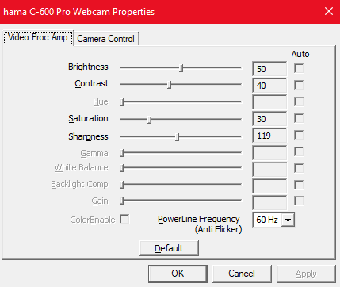

# dbj camera properties

Every Windows contains this elusive camera properties dialogue

That is a front end to the control of your camera (should you have one). Every app running on windows uses the same API used behind that dialogue to control camera properties. And some cameras do not have control software "in the box".

But if you happen not to have such an app and you just want your litle camera so that you can take part in on-line meetings how do you control your camera properties? Some meeting apps cam help but some don't. As an example from Google Meet (in 2025Q4) users can not change camera properties.

So what you do if your director is on the call and she complains you are blurred? And there is no camera control app handy.

You then fire up `dbj_cameraprop.exe` you have just built with this super simple code you can find here. Since you are reading this I assume you know how to use Visual Studio to build app from this code. And perhaps distribute it to your friends. There is no license.

There are no dependencies. All is in Windows. And since only core API's are used this should build and run on many Windows versions. I have not checked, yet.

dbj@dbj.org 

CC BY SA 4.0

---